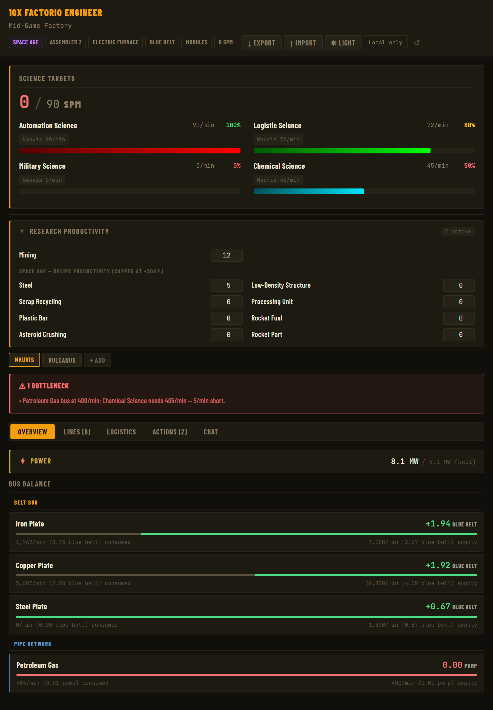
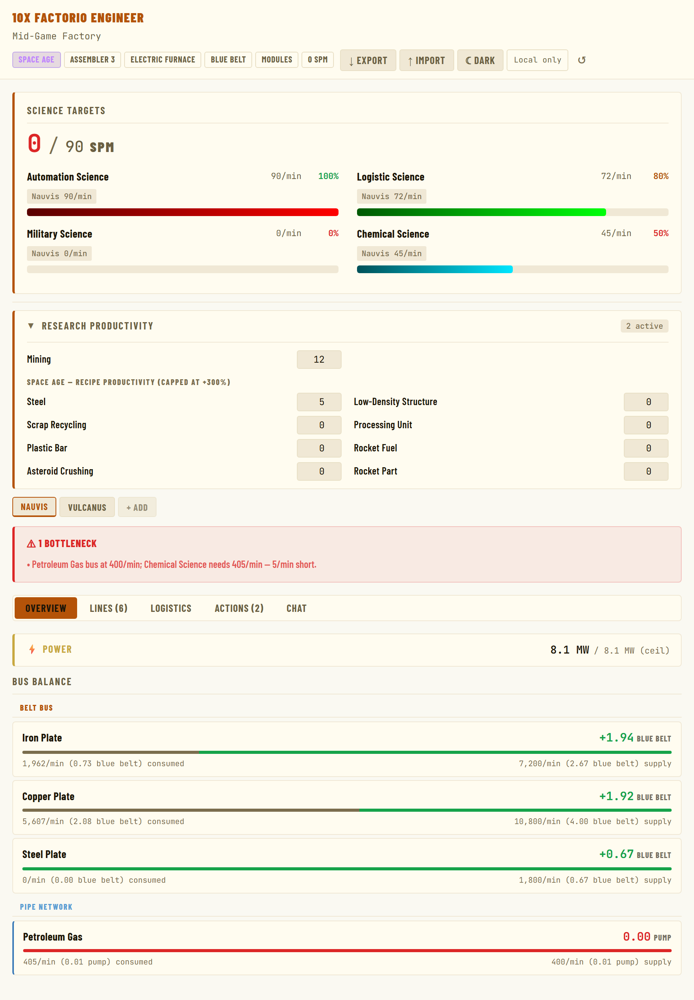

# 10x Factorio Engineer

A Factorio factory co-pilot built on two components:

| Component | What it does |
|-----------|-------------|
| **CLI Calculator** (`assets/cli.py`) | Zero-dependency Python CLI — resolves full production chains and emits clean JSON |
| **Claude Skill** (`10x-factorio-engineer/`) | System-prompt + published web artifact that turns Claude into an active planning assistant |

---

## Repository Structure

```
10x-factorio-engineer/
  SKILL.md                  # Skill definition — CLI usage, output format, factory state schema
  assets/
    cli.py                  # Calculator — entire implementation
    dashboard.html          # Built artifact — paste into claude.ai as application/vnd.ant.html
    vanilla-2.0.55.json     # KirkMcDonald dataset — base game
    space-age-2.0.55.json   # KirkMcDonald dataset — Space Age DLC
  references/
    *.md                    # Split strategy reference files (11 topics: early-game, factory-layouts, trains, megabase, planets, space-platforms, power, combat-defense, logistics-circuits, quality, resources)
dev/
  dashboard.html            # Dashboard source — single vanilla HTML, no build deps
  build_dashboard.py        # Minifies dashboard.html → assets/dashboard.html
  preview.py                # Generates preview.tmp.html with factory state pre-loaded; use Claude Preview MCP to view
  sample/
    state.json              # Sample factory state source JSON — edit directly, paste into Import dialog to test
  my-factory.json           # Dev factory state for local testing
  test_cli.py               # unittest suite (198 tests, stdlib only)
  quality_planner.py        # Legendary production planner (V1 MVP) — DP quality loop solver
  test_quality_planner.py   # unittest suite (116 tests) for quality_planner
  artifact-api/
    test.html               # claude.ai runtime API test suite — paste as vnd.ant.html to verify window.claude/storage
    research.md             # Field research doc for claude.ai artifact APIs
```

Data files are vendored; auto-downloaded from KirkMcDonald's GitHub on first run.

---

## Component 1 — CLI Calculator

**Requirements:** Python 3.10+, no third-party packages.

```bash
# Basic usage
python assets/cli.py --item electronic-circuit --rate 60

# Multi-target: solve two items at once (shared sub-recipes merged)
python assets/cli.py --item electronic-circuit --rate 60 --item automation-science-pack --rate 30

# Productivity + beacon modules
python assets/cli.py --item electronic-circuit --rate 60 \
    --modules "assembling-machine-3=4:prod:3:normal" \
    --beacon "assembling-machine-3=8:3:legendary" \
    --machine-quality legendary

# Infinite research productivity (mining L5 + steel L3)
python assets/cli.py --item steel-plate --rate 60 \
    --research mining-productivity=5 \
    --research steel-productivity=3

# Override recipe
python assets/cli.py --item solid-fuel --rate 20 --recipe solid-fuel=solid-fuel-from-light-oil

# Machine-count mode — specify machines instead of a target rate
python assets/cli.py --item transport-belt --machines 2 --assembler 2

# Bus items (pull iron/copper from bus, don't recurse into smelting)
python assets/cli.py --item electronic-circuit --rate 1800 \
    --bus-item iron-plate --bus-item copper-plate

# Space Age with big mining drills (Fulgora)
python assets/cli.py --item holmium-plate --rate 30 --location fulgora --miner big

# Pipe into jq
python assets/cli.py --item processing-unit --rate 10 | jq .raw_resources

# Human-readable terminal output
python assets/cli.py --item electronic-circuit --rate 60 --format human
```

Use `--format human` for a quick terminal overview; omit it (or pass `--format json`) to get structured JSON for piping to `jq` or other tools.

#### Sample `--format human` output

```
$ python assets/cli.py --item electronic-circuit --rate 60 --format human

=== electronic-circuit @ 60.0/min ===
Location: vanilla  |  Assembler: 3  |  Furnace: electric  |  Miner: electric

Production Steps
----------------
copper-cable                    180.0/min    0.6 -> 1 assembling-machine-3
  power: 225.0 kW  (375.0 kW ceil)
  <- copper-plate                  90.0/min

copper-plate                    90.0/min    2.4 -> 3 electric-furnace
  power: 432.0 kW  (540.0 kW ceil)
  <- copper-ore                    90.0/min

iron-plate                      60.0/min    1.6 -> 2 electric-furnace
  power: 288.0 kW  (360.0 kW ceil)
  <- iron-ore                      60.0/min

electronic-circuit              60.0/min    0.4 -> 1 assembling-machine-3
  power: 150.0 kW  (375.0 kW ceil)
  <- copper-cable                  180.0/min
  <- iron-plate                    60.0/min

Raw Resources
-------------
  copper-ore                      90.0/min
  iron-ore                        60.0/min

Miners Needed
-------------
  iron-ore                        2.0 electric-mining-drill (2 ceil)
  copper-ore                      3.0 electric-mining-drill (3 ceil)

Power
-----
  Total: 1.545 MW  (2.1 MW with ceil counts)
```

With modules + beacons + machine quality the header shows configuration and each step includes a detail line:
```
=== electronic-circuit @ 60.0/min ===
Location: vanilla  |  Assembler: 3  |  Furnace: electric  |  Miner: electric
Machine quality: legendary  |  Beacon quality: normal
Modules:  assembling-machine-3 = 4x prod-3-normal
Beacons:  assembling-machine-3 = 8x tier-3-legendary

Production Steps
----------------
electronic-circuit              60.0/min    0.0098 -> 1 legendary assembling-machine-3
  modules: 4x prod-3-normal  |  beacons: 8x tier-3-legendary  |  speed bonus: +10.6066
  power: 15.5084 kW  (1575.0 kW ceil)  +  960.0 kW beacons
  <- copper-cable                  128.5714/min
  <- iron-plate                    42.8571/min
...
```

See [SKILL.md §2](10x-factorio-engineer/SKILL.md) for the complete flags reference and full JSON output shape.

### Running Tests

```bash
python -m unittest dev.test_cli -v
python -m unittest dev.test_quality_planner -v
```

198 CLI tests + 116 quality-planner tests, stdlib only.

### Legendary Production Planner (V1 + V2 + V3-partial)

`dev/quality_planner.py` is a separate tool focused on legendary-tier production.
It computes the cheapest input rate and the per-stage machine / module layout
for a target legendary item + rate.

```bash
# V1: asteroid-reprocessing chain (Nauvis-only items)
python dev/quality_planner.py --item electronic-circuit --rate 60 \
    --module-quality legendary \
    --research asteroid-productivity=5

# V2: multi-planet (mined-raw self-recycle for coal, stone, tungsten-ore,
# scrap, holmium-ore, uranium-ore; planet-exclusive fluids)
python dev/quality_planner.py --item processing-unit --rate 60 \
    --planets nauvis

python dev/quality_planner.py --item artillery-shell --rate 60 \
    --planets nauvis,vulcanus

# V3-partial: LDS shuffle replaces plastic-bar leg with foundry-cast LDS +
# recycle (legendary plastic + copper/steel byproducts).  Cuts mined-coal
# self-recycle entirely; benefits scale with plastic-bar / LDS productivity.
python dev/quality_planner.py --item processing-unit --rate 60 \
    --planets nauvis --enable-lds-shuffle \
    --research low-density-structure-productivity=10 \
    --research plastic-bar-productivity=10

# V3 item 4 partial: Gleba bio-raws (yumako, jellynut, pentapod-egg)
# via self-recycle. Spoilage timing is NOT modelled yet — long quality
# loops on bioflux/nutrients give optimistic counts.
python dev/quality_planner.py --item bioflux --rate 60 --planets gleba
python dev/quality_planner.py --item plastic-bar --rate 60 --planets gleba
python dev/quality_planner.py --item rocket-fuel --rate 60 --planets gleba

# V3 item 5: prod modules in every assembly stage (drops machines ~20× on
# fluid-cast chains because each foundry/EM-plant/cryogenic-plant gets
# 4-8 prod-3-legendary modules + inherent +50%, capped at +300%).
python dev/quality_planner.py --item processing-unit --rate 60 \
    --planets nauvis --assembly-modules

# V3 small: legendary-quality machines (+150% speed → ~40% machine count).
# Stacks with --assembly-modules; total power scales linearly.
python dev/quality_planner.py --item processing-unit --rate 60 \
    --planets nauvis --assembly-modules --machine-quality legendary

# V3 item 3: self-recycling targets (recycle returns the item itself)
python dev/quality_planner.py --item superconductor --rate 60 \
    --planets nauvis,fulgora
python dev/quality_planner.py --item tungsten-carbide --rate 60 \
    --planets nauvis,vulcanus
python dev/quality_planner.py --item holmium-plate --rate 60 --planets fulgora
```

Reachable items today:
- **Asteroid-only** (no `--planets`): items whose raws are all asteroid-reachable
  (iron, copper, stone, calcite, ice).
- **+ Nauvis**: chemistry chain (plastic-bar, sulfur, processing-unit, etc.) via
  mined-coal self-recycle + petgas via crude-oil.
- **+ Vulcanus / Fulgora / Aquilo**: planet-exclusive raws (tungsten-ore,
  scrap, holmium-ore, ammoniacal-solution).
- **+ Gleba** (partial): yumako / jellynut / pentapod-egg via self-recycle;
  bioflux, nutrients, biosulfur, biolubricant, bioplastic, rocket-fuel via
  biochamber recipes.  **Spoilage timing is NOT modelled** — long quality
  loops on spoiling intermediates give optimistic counts.
- **Self-recycle targets**: `tungsten-carbide`, `superconductor`, `holmium-plate`,
  `fusion-power-cell`, `lithium`.

Items deferred (still fail fast or imprecise): Gleba pentapod-egg as a target
(self-multiplying recipe needs a bespoke solver), Gleba spoilage timing,
self-recycling items as **intermediate ingredients** of another chain.  See
`dev/quality_planner_v2.md` for the full V3 roadmap.

---

## Component 2 — Claude Skill

`SKILL.md` turns Claude into an active factory co-pilot:

- **CLI mode** — Claude calls `python assets/cli.py` for all production math, tracks factory state conversationally, and outputs `FACTORY_STATE` JSON at session end for import into the dashboard.
- **Dashboard mode** — a published `application/vnd.ant.html` artifact with an Overview tab (science SPM headline + grouped production lines), Bus Balance (player-declared bus items vs. consumed rates), per-line machine tables with per-recipe inputs/outputs and belt counts, bottleneck detection, and in-artifact chat. Dark and light themes; state persists via `window.storage` (cross-device) with `localStorage` fallback. Import/Export buttons sync state with CLI sessions.

See [SKILL.md §3](10x-factorio-engineer/SKILL.md) for the factory state schema shared by the skill and the dashboard.

### Dashboard screenshots

| Dark theme | Light theme |
|:----------:|:-----------:|
|  |  |

### Building the dashboard

```bash
python dev/build_dashboard.py    # minify dev/dashboard.html → assets/dashboard.html
python dev/build_dashboard.py --open    # build and open in browser
python dev/preview.py            # preview with dev/sample/state.json pre-loaded
python dev/preview.py --state PATH/TO/x.json  # preview with a custom state file
```

---

## Data Source

Dataset JSON files are sourced from
[KirkMcDonald/kirkmcdonald.github.io](https://github.com/KirkMcDonald/kirkmcdonald.github.io),
the same data that powers <https://kirkmcdonald.github.io/calc.html>.

---

## Future Work

### CLI / Calculator

- **Quality recycling loops** — V1 implemented in `dev/quality_planner.py` (asteroid-path only); V2 will extend to per-item recycling loops, planet exclusives, and self-recycling items

### Skill / Workflow

- **GitHub Actions: skill zip** — bundle `SKILL.md`, `assets/`, and `references/` into a `.zip` for claude.ai project knowledge

### Infra

- **GitHub Actions: test runner** — run `dev/test_cli.py` on every push to `main` and on PRs

---

## License

The source code (`10x-factorio-engineer/`, `dev/`) is MIT licensed — see [LICENSE](LICENSE).

The vendored data files (`10x-factorio-engineer/assets/*.json`) are from KirkMcDonald's Factorio
Calculator and are licensed under the **Apache License 2.0**. See [NOTICE](NOTICE)
for attribution details.
